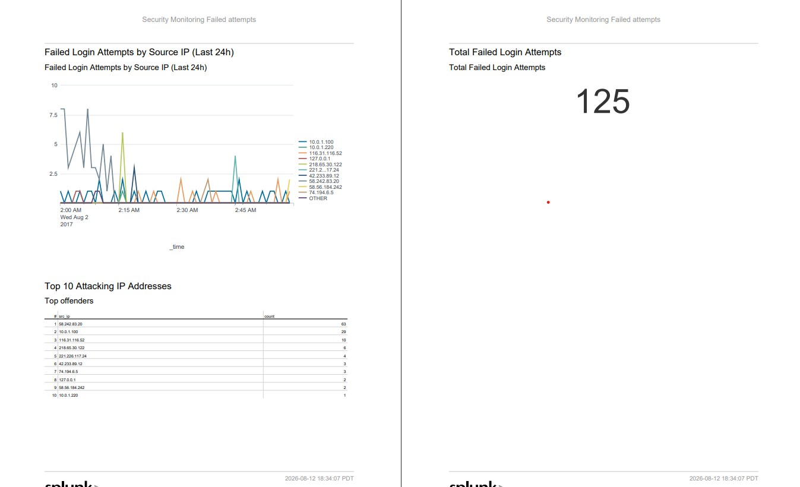

# splunk-security-dashboard

## Overview
This project demonstrates a Splunk-based security monitoring dashboard for tracking failed authentication attempts. Built as part of a hands-on lab to secure monitoring and alerting 
## Features
- **Real-time Monitoring**: Tracks failed login attempts by source IP over time
- **Top Offenders View**: Identifies IP address with the highest number of failed attempts
- **Threshold-Based Alerting**: Automatically triggers alerts when a single IP exceeds 5 failed attempts in 5 minutes

## Dashboard Panels
1. **Failed Login Attempts by Source IP** - Line chart showing failure trends over time
2. **Top 10 Attacking IP Addresses** - Table ranked by total failure count
3. **Total Failed Login Attempts** - Single value showing overall failure volume

## Alert Rule
- **Condition**: > 5 failed logins from single IP in 5 minutes
- **Action**: Email notification
- **Use case**: Rapid detection of brute force or credential stuffing attacks
## Technologies Used
- Splunk
- SPL
- Window Event Logs (4625)
## Key SPL Searches 
### Time-based visualization 
```text
index=* (tag=authentication action=failure) OR (sourcetype="XmlWinEventLog:Security" EventCode=4625)) | timechart count by src_ip
```
### Top offenders 
```
index=* (tag=authentication action=failure) OR (sourcetype="XmlWinEventLog:Security" EventCode=4625)) | stats count by src_ip | sort - count | head 10
```
## Screenshots
                   
## Lesson learned: Investigation a Targeted Root Brute-Force Attack

### Overview
In this task, I identified `58.242.83.20` as the source of 63 failed authentication attempts as the highest in my dataset. Rather than stopping at the dashboard number, I conducted a deep-dive investigation to understand the attacker's behavior, intent, and risk level.

### Investigation Process 
#### step 1 Verify if compromise occurred
- **Query**: `src_ip="58.242.83.20"`
- **Finding**: 63 failures, **Zero successful logins**
- **Conclusion**: The attack was unsuccessful and no breach occurred.
#### step 2 Identify target accounts
- **Query**: `src_ip="58.242.83.20" | stats count by user`
- **Finding**: 100% of attempts targeted the `root` account
- **Conclusion**: This was a **targeted attack** not opportunistic. The attacker specifically sought the most privileged Unix/Linux account, indicating they understood the environment.
- 
#### step 3 Analyse attack timing and patterns
- **Query**: `src_ip="58.242.83.20" | timechart count`
- **Finding**:3
  - all 63 attempts occurred between ***02:00 - 02:14 AM** (server time)
  - Attempts were evenly distributed at **~4.2 per minutes**( 1 attempt every 14.3 seconds)
- **Conclusion**: The consistent pace suggests an automated brute-force tool deliberately throttled to avoid triggering account lockout policies.

#### step 4 Geolocate and contextualize the source
- **Query**: `| iplocation src_ip`
- **Finding**:
  - **Location**: Shanghai, China
  - **Network**: AS4837 (CHINA169-Backbone, China Unicom)
  - **Risk Indicator**: Not a VPN/Proxy therefore it is originated from legitimate Chinese infrastructure 
- **Conclusion**: The attack originated from major Chinese ISP's backbone network, This could indicate the following
    - A compromised enterprise server within China
    - State- sponsored reconnaissance (PLA Unit 61398 has historically used China Unicom infrastructure)
    - A rented VPS in a Chinese datacenter
## Key Security Insights

| Observation | Implication |
| :--- | :--- |
| Targeted root account | Attackers had prior knowledge or were using a focused playbook—not a generic scanner |
| Off-hours timing (2 AM) | Attackers assume minimal monitoring during night shifts |
| Stealthy 4 attempts/minute | Attackers understand account lockout thresholds and deliberately avoid them |
| Legitimate ISP backbone | Simple geo-blocking isn't enough—this IP is from a major ISP, not a known proxy/VPN |
| No successful logins | Strong passwords on the root account successfully mitigated the attack |
## Recommended Actions
1. **Immediate**: Block `58.242.83.20` at the firewall ( would have stopped 63 attacks)
2. **Short-term**:
   - Implement failed login threshold alerts
   - Enforce lockout policies after 5 failed attempts
3. **Long-term**:
   - Disable root SSH login (force sudo usage)
   - Implement geo-IP restrictions for adminstrative access
   - Consider fail2ban or equivalent automated blocking 
## Why this Matters
- **Alert triage**: Not all failed logins are equal. This investigation showed how to distinguish between opportunistic scanning and targeted attack
- **Context is Everything**: raw data of 63 attempts becomes intelligence when combined with timing, accounting targeting and geolocation
- **Proactive defense**: Monitoring without response is noise. The investigation naturally led to concrete recommendations to improve security posture.
## Technical SPL Queries Used

